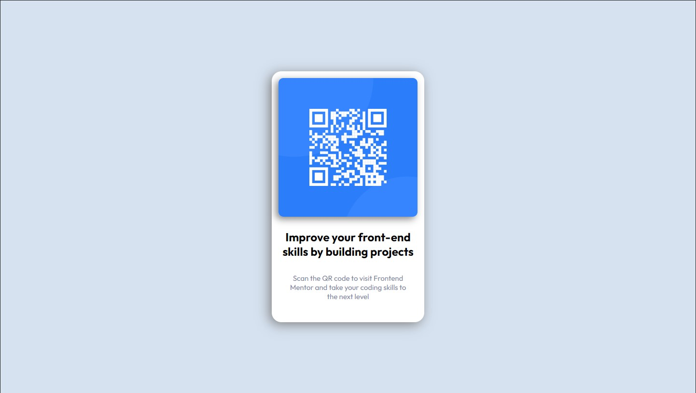

# fm_QR-code-challenge
QR code challenge from Frontend Mentor
# Frontend Mentor - QR code component solution

This is a solution to the [QR code component challenge on Frontend Mentor](https://www.frontendmentor.io/challenges/qr-code-component-iux_sIO_H). Frontend Mentor challenges help you improve your coding skills by building realistic projects. 

## Table of contents

  - [Screenshot](#screenshot)
  - [Links](#links)
- [My process](#my-process)
  - [Built with](#built-with)
  - [What I learned](#what-i-learned)
  - [Continued development](#continued-development)
  - [Useful resources](#useful-resources)
- [Author](#author)
- [Acknowledgments](#acknowledgments)

### Screenshot

### Links

- Solution URL: [qr code solution](https://github.com/palmettophoto/fm_qr-code-challenge/)
- Live Site URL: [Add live site URL here](https://palmettophoto.github.io/fm_QR-code-challenge/)

## My process

### Built with

- Semantic HTML5 markup
- CSS custom properties
- Flexbox
- CSS Grid

### What I learned

During the design of this project I tried to focus on using relative sizing units to ease the process of adding responsiveness. I learned that I do in fact need to practice. A lot.

### Continued development

I hope to continue to develop my css skills to a mastery level. Specifically positioning.

### Useful resources

-w3 schools (https://www.w3schools.com/)
-mdn web docs (https://developer.mozilla.org/)

## Author

- Website - [Tad Atkinson](https://www.rockhillvideo.com)
- Frontend Mentor - [@Taddo](https://www.frontendmentor.io/profile/taddo)
